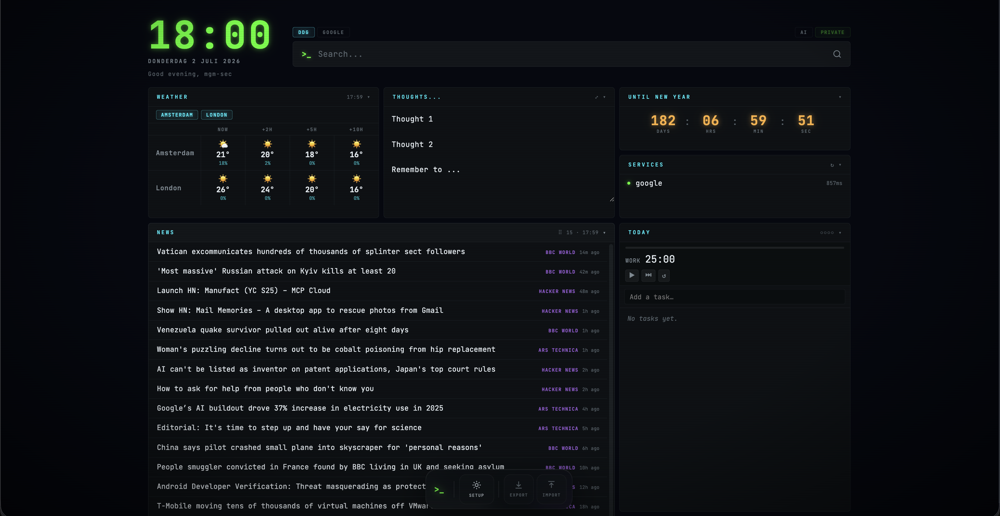

# openDash

A self-hosted personal start page. Vanilla JS, zero dependencies, one Node server, terminal-phosphor aesthetic.



**Zero-dependency, precisely:** there is no `package.json` and nothing is installed from npm. `server.js` uses only Node built-ins (`node:http`, `node:fs`, `node:path`, and the built-in `fetch` from Node 18+); the frontend is vanilla JS with no framework or bundler. Two runtime caveats that are network dependencies, not code dependencies: (1) `index.html` loads JetBrains Mono and Space Grotesk from Google Fonts (`fonts.googleapis.com`/`fonts.gstatic.com`) — offline it degrades to fallback fonts, and the CSP explicitly allows only these two font hosts; (2) the browser calls Open-Meteo directly for weather, and the server proxies whatever RSS feeds and health-check URLs you configure. The Docker image itself depends only on the Node runtime: `node:26-alpine` with npm/yarn/corepack removed at build time.

**Tiles:** Weather (Open-Meteo, no API key) · News (any RSS/Atom feeds) · "Until…" countdown · Today task list + Pomodoro · Service health pings · Scratchpad. Plus clock, greeting, and a DDG/Google search bar.

Every tile is drag-and-drop movable, resizable, collapsible, renamable, and hideable. All settings are editable from the **⚙ SETUP** button — no config file edits needed. Data lives entirely in your browser's localStorage (export/import buttons in the dock for backups).

## Quickstart

```bash
docker compose up -d --build
# → http://localhost:8151
```

Runs as a non-root user on node:26-alpine (zero known CVEs, npm/yarn stripped from the image; Node 26 enters LTS ~Nov 2026) with a read-only filesystem and all capabilities dropped. Dependabot keeps the base image updated weekly. Port is `PORT`-overridable (default 8151).

## Configuration

Click **⚙ SETUP** in the dock: name/greeting, weather locations, RSS feeds, countdown label/date, services to ping, and per-tile rename/hide. Saved to localStorage and merged over the defaults in `config.js` (edit that file to change the defaults themselves, e.g. background, pomodoro durations, refresh intervals).

## Notes

- The server exists only to serve the static files and proxy `/rss` (CORS) and `/ping` (health checks). Those proxies are **open** (no auth, no allow-list — anyone who can reach the port can make the server fetch arbitrary URLs, including internal ones). The compose file therefore binds to `127.0.0.1` only, so the dashboard is reachable solely from the host machine. To use it from other devices on your LAN, drop the `127.0.0.1:` prefix from the port mapping — but never expose it to the internet without auth in front.
- Weather is fetched directly from the browser via [Open-Meteo](https://open-meteo.com/).
- Pomodoro notifications use a service worker; allow notifications when prompted.

## License

[EUPL-1.2](LICENSE)
